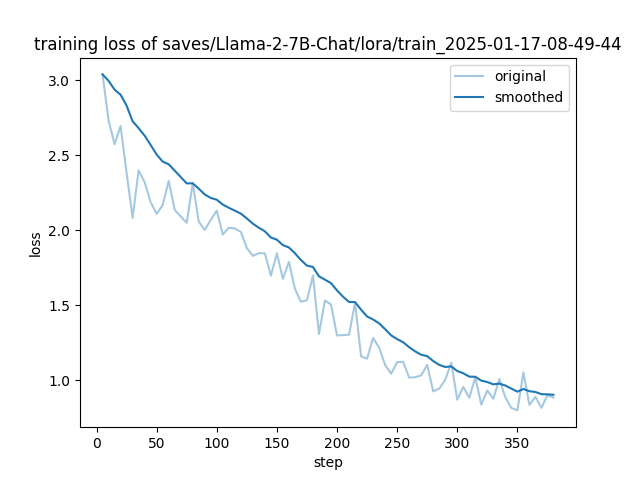
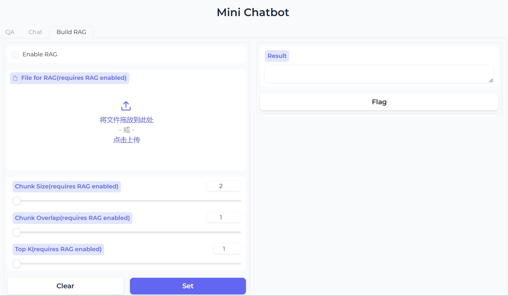

# 大模型原理 期末作业文档
Our project aims to explore the finetuning, application development as well as RAG(Retrieval Augmented Generation) in the field of large language models. We finetuned the Llama model on Trump's interviews and built a mini Chatbot with WebUI based on the library `Gradio` to chat with LLMs conveniently. We further provide a method to extend the model's knowledge capacity with RAG based on the file user provided.
## Prepare
```sh
bash prepare.sh
```
- Environment
```sh
conda install -f environment.yml
```
## Content
### Part 1 : Finetuning Llama with LLaMA-Factory
- We finetuned the base model [Llama-2-7b-chat](https://huggingface.co/meta-llama/Llama-2-7b-chat-hf) on the [dataset](https://huggingface.co/datasets/pookie3000/trump-interviews) containing Trump's interviews. 

- Model is available at [Huggingface](https://huggingface.co/rachmanino/Llama-2-7B-chat-Trump-v1).


### Part 2: WebUI Chatbot
We build a mini Chatbot with WebUI based on `Gradio` to chat with LLMs conveniently. 
- Usage:
```sh
python app.py
```
Then, open the application in your browser.

The Chatbot currently supports single-round `QA` and conversation with memory, i.e. `chat`. The model finetuned in Part 1 is also available to try.
Different generation choices are provided,  such as KVCache options, temperature, maximum generation length, etc. 

### Part 3: Extending Llama's knowledge with RAG
Based on the WebUI implemented in Part 2, we further build a RAG system to extend the model's knowledge based on the file user provided.

- Usage:
  - 1. Click the `Enable RAG` button
  - 2. Upload the file to build database on. Only `.txt` file is supported currently.
  - 3. Choose `Chunk Size`, `Chunk Overlap` and `Top-k`, then click `Set` button
  - 4. Once the database is built, Then you can chat with the model with the extended knowledge in `QA` or `chat` mode. To cancel it, click off the `Enable RAG` button and click `Set` button again.
  
### Part 4: Visualizing Attention Score
We further provide a demo to visualize the attention score of LLMs on the prompt in the prefill stage.
```sh
cd vis
python app.py
```
Then, open the application in your browser. As your mouse hover on the prompt, the attention score will be shown via the color.


## 分工
- 吴童：微调模型（Part1），构建WebUI（Part2），RAG（Part3），文档编写，视频录制
- 蔡鑫豪：注意力可视化（Part4），文档编写
- 林思雨：构建WebUI（Part2），PPT制作

## Extra Info
- CUDA version: 12.4
- GPU: 1x NVIDIA RTX4090